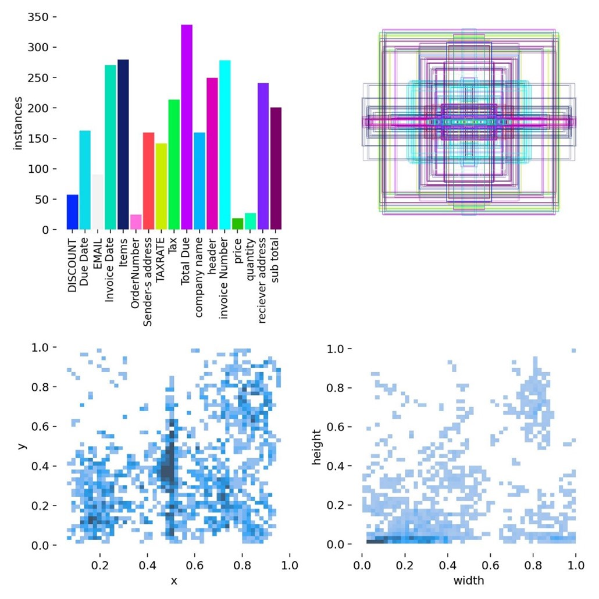
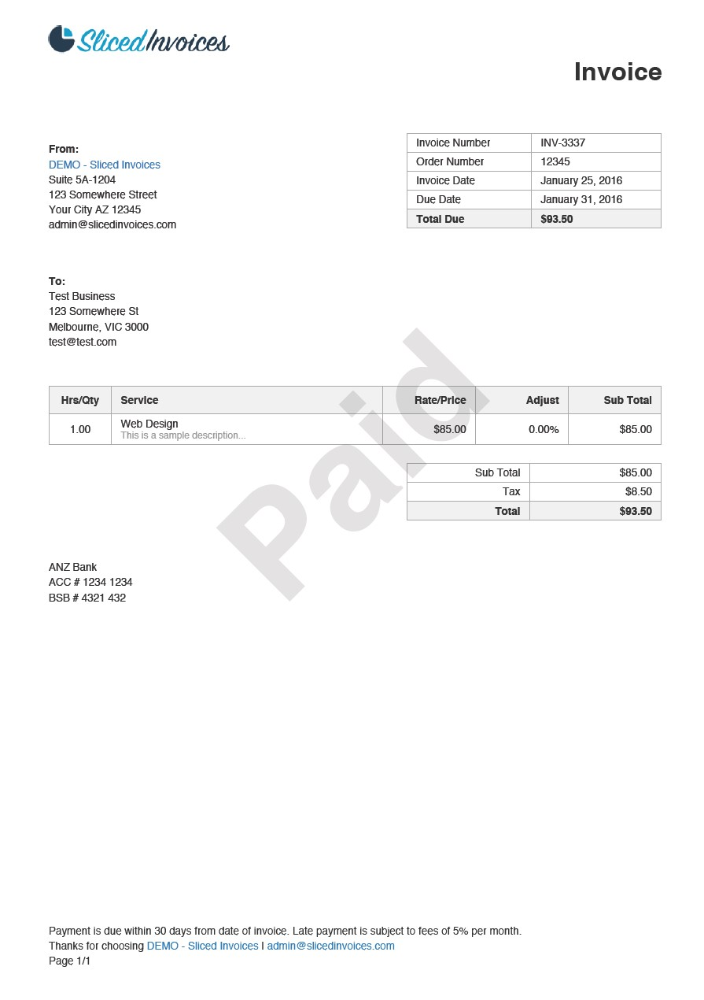
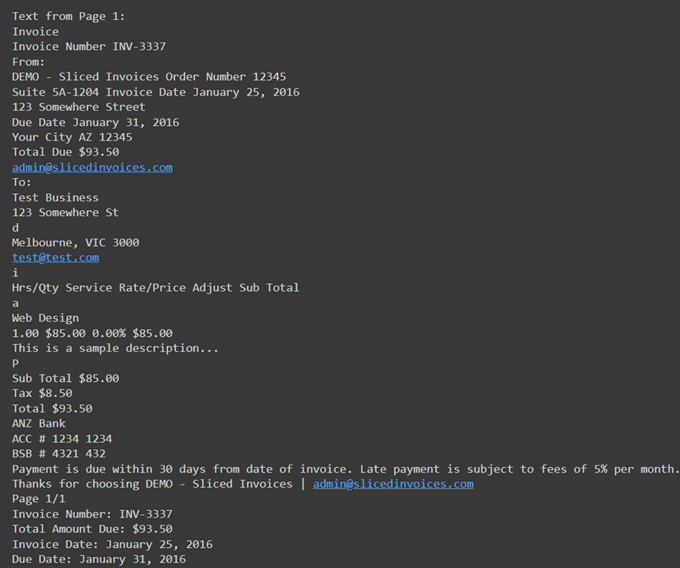
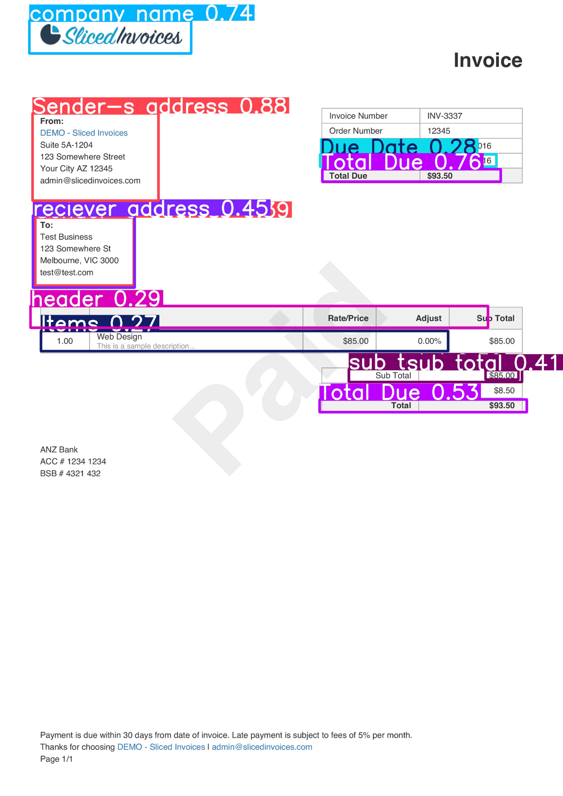

# InvoiceTextDetect🔎

# Invoice OCR and YOLOv8 Object Detection Project✨

This repository contains code for extracting invoice details from PDFs using Optical Character Recognition (OCR) and object detection using the YOLOv8 model. The project leverages various tools and libraries, including `pdfplumber`, `pytesseract`, and `YOLOv8`, to process PDF files, extract text, and detect objects in images.

[Google colab link: https://colab.research.google.com/drive/1Cnw8r5y-mFpQqy1Ph4BQPYffjP2me0g-](https://colab.research.google.com/drive/1Cnw8r5y-mFpQqy1Ph4BQPYffjP2me0g-)

## Project Overview

The main objectives of this project are:

1. **Invoice Data Extraction**: Extract important details like invoice number, total amount due, invoice date, and due date from PDF invoices using OCR.
2. **Object Detection with YOLOv8**: Train a YOLOv8 model on custom datasets to detect specific objects within images.
3. **PDF to Image Conversion**: Convert PDF files to images for visual debugging and further processing.

## Requirements

- Python 3.x
- NVIDIA GPU with CUDA support (for YOLOv8 training)
- Required Python packages (install using `pip`):
  - `ultralytics`
  - `pdf2image`
  - `pdfplumber`
  - `pytesseract`
  - `ocrmypdf`
  - `roboflow`

## Setup Instructions

1. Clone the repository:
   ```bash
   git clone https://github.com/yourusername/your-repo-name.git
   cd your-repo-name

2. Install the required packages:

```bash
Copy code
pip install ultralytics pdf2image pdfplumber pytesseract ocrmypdf roboflow
sudo apt-get install poppler-utils
```
3. Download and prepare the dataset using Roboflow:
```bash
Copy code
from roboflow import Roboflow
rf = Roboflow(api_key="your_roboflow_api_key")
project = rf.workspace("your_workspace").project("your_project")
version = project.version(5)
dataset = version.download("yolov8")
```

# Running the Code
**Invoice Data Extraction**
1. Convert PDF invoices to images:
```bash
   from pdf2image import convert_from_path
invoice = convert_from_path("/content/pdfs/invoice2.pdf", dpi=300)
invoice[0].save("/content/pdfs/invoice_page_1.jpg", "JPEG")
```

2. Extract invoice details:
```bash
def extract_invoice_details(text):
    # Extraction logic here...
    return invoice_number, total_amount_due, invoice_date, due_date

def process_pdf(input_path, use_ocr=False):
    # Processing logic here...
    pass

process_pdf("/content/pdfs/invoice2.pdf", use_ocr=True)
```
# YOLOv8 Object Detection
1. Train the YOLOv8 model on your dataset:
   ```bash
   from ultralytics import YOLO
   model = YOLO("yolov8n.pt")
   results = model.train(data="/content/Namit_ocr-5/data.yaml", epochs=40, imgsz=640, batch=8)
   ```
  
2. Run object detection on images.



# Results
1. The extracted invoice data will be printed to the console.

  
2. YOLOv8 training results, including validation metrics and detected objects, will be saved in the /content/runs/detect/ directory


